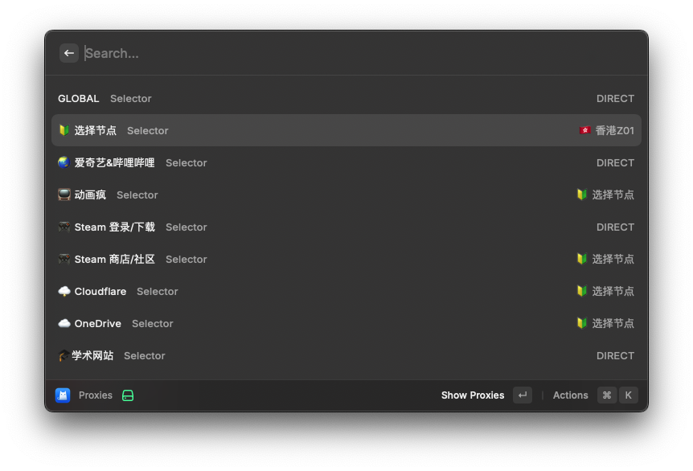
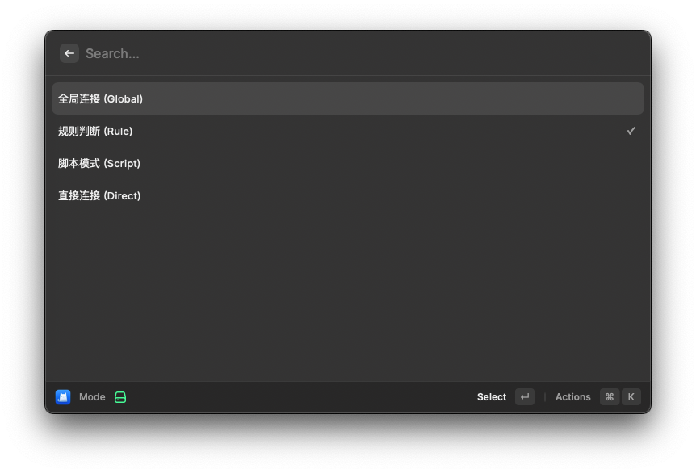
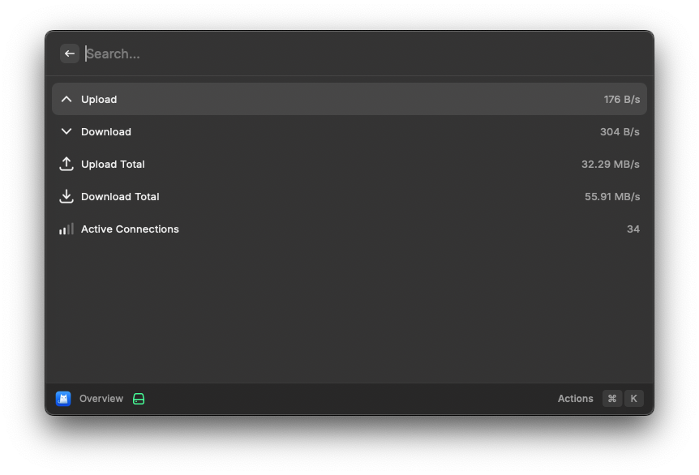
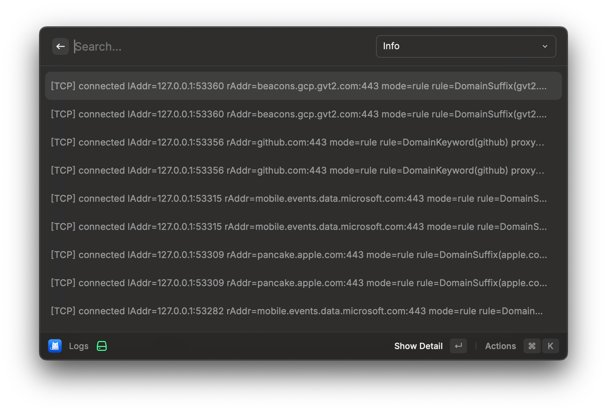

# Raycast Clash

Monitor your Clash with Raycast.

```sh
npx rayext install jinghaihan/raycast-clash
```

<div align="center">
  
  
</div>

<div align="center">
  
  
</div>

## Commands

<!-- commands -->

| Title                 | Description                |
| --------------------- | -------------------------- |
| `Overview`            | Overview of Clash status   |
| `Mode`                | Switch proxy mode          |
| `Proxies`             | Select proxy               |
| `Logs`                | View logs                  |
| `Toggle System Proxy` | Toggle system proxy on/off |

<!-- commands -->

## Configuration

<!-- configs -->

| Key                | Description                  | Required | Default                               |
| ------------------ | ---------------------------- | -------- | ------------------------------------- |
| `app`              | The app to toggle proxy      | `No`     | ClashX Pro                            |
| `url`              | The URL of the Clash API     | `No`     | http://127.0.0.1:9090                 |
| `secret`           | The secret of the Clash API  | `No`     |                                       |
| `benchmarkTimeout` | The timeout of the benchmark | `No`     | 5000                                  |
| `benchmarkUrl`     | The URL of the benchmark     | `No`     | http://cp.cloudflare.com/generate_204 |

<!-- configs -->

## License

[MIT](./LICENSE) License © [jinghaihan](https://github.com/jinghaihan)
